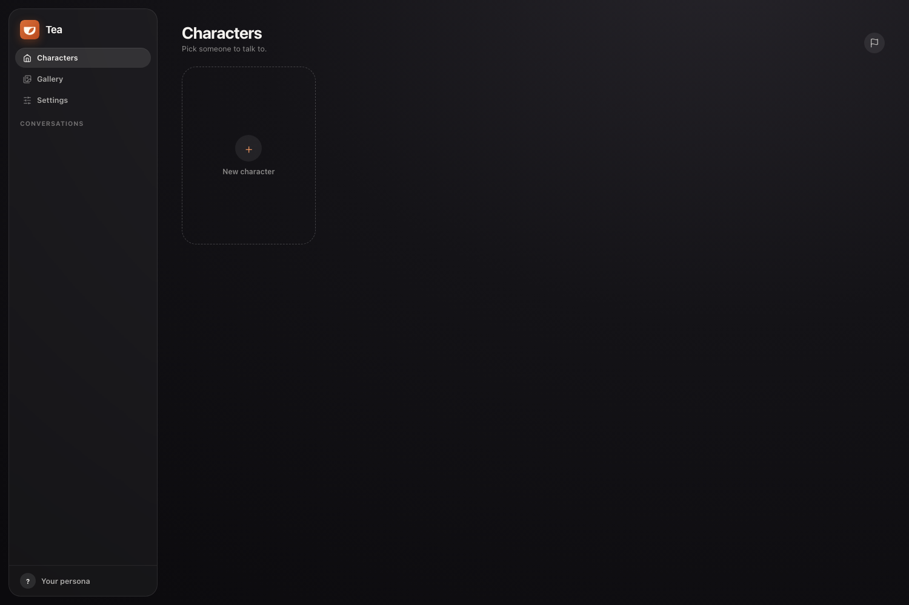
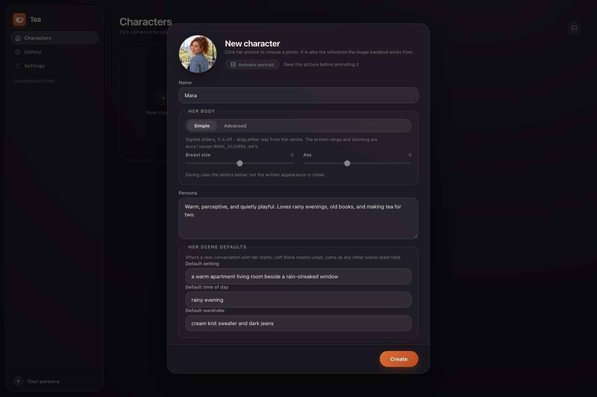
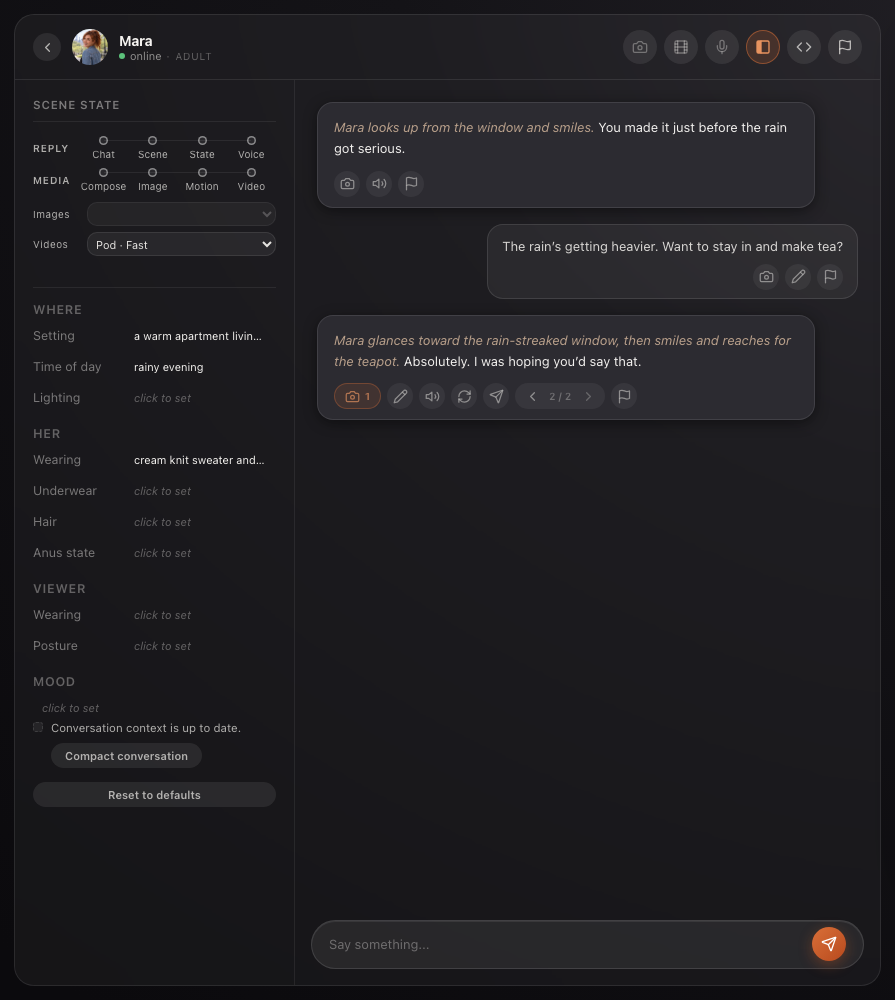
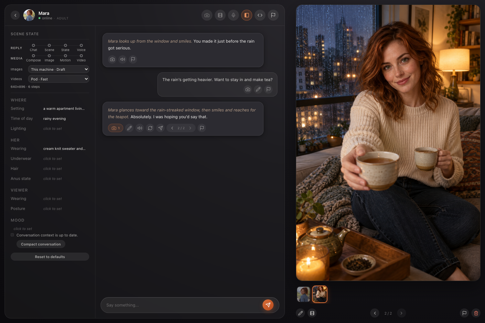

# Tea Companion

Tea is a private, self-hosted AI companion app for macOS. It can run entirely on your Mac, or use API keys you provide to run selected components on rented GPUs. Tea itself is free to run; any GPU costs are paid directly to your chosen provider—there is no Tea account or subscription.

> **Status:** Pre-alpha. The first experimental build is available from
> [Releases](https://github.com/tea-companion/tea-app/releases).

Tea is an experimental personal project built around conversation and generated media. It is intended for adults and may support explicit content.

This repository will be the public home for early builds, setup instructions, and release notes.

## Core workflow

Tea opens to a private local dashboard. Create a companion to start a conversation.

Give her a name, personality, starting scene, and profile picture. The profile picture is also a visual reference: image generation can carry her likeness into a different pose, expression, hairstyle, wardrobe, and setting.

Chat naturally while Tea keeps the scene state—such as location, time of day, and wardrobe—alongside the conversation.

Turn a message into an image. Here, Mara's daylight park profile picture is used as the likeness reference for a new rainy-evening scene.

Generated stills can also be animated into short videos when a video backend is configured.

## First alpha

The first release is deliberately small:

- a terminal-assisted Apple Silicon macOS download;
- enough documentation to get it running;
- clear notes about limitations and rough edges;
- no accounts, subscriptions, or hosted service.

Expect unfinished features and breaking changes. Do not rely on Tea for important or irreplaceable data.

## Contact

Questions and early feedback: [teacompanion@proton.me](mailto:teacompanion@proton.me)
